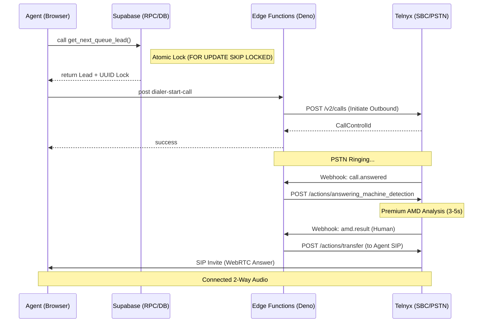

# Dialer System Diagnostic Report — AgentFlow
**Date:** 2026-04-07
**Audience:** Senior Software Engineers / Technical Stakeholders

## 1. Executive Summary
The AgentFlow dialer is a distributed, high-concurrency real-time communication system. It integrates **React/WebRTC** (front-end), **Supabase/PostgreSQL** (locking & state), and **Telnyx REST/Webhooks** (telephony layer). The system uses a "Two-Lane" state machine to handle both automated and manual disposition paths.

> [!IMPORTANT]
> This diagnostic confirms that the system logic for **Atomic Locking** (`SELECT FOR UPDATE SKIP LOCKED`) and **Two-Lane Automation** is technically sound but identifies critical latency and synchronization risks in the Webhook-to-Agent bridging phase.

---

## 2. Technical Architecture Overview

---

## 3. Deep-Dive Layer Audit

### 3.1 Database: Atomic Locking Logic
The core of the "Power Dialer" prevents race conditions using a hybrid table/RPC locking system.
- **RPC:** `get_next_queue_lead(p_campaign_id, p_filters)`
- **Mechanism:** [Migration 20260405100000](file:///Users/CHRIS/AgentFlow/agentflow-life-insure/supabase/migrations/20260405100000_smart_queue_lock_system.sql)
  - Uses `SELECT cl.id INTO v_locked_id ... FOR UPDATE OF cl SKIP LOCKED`.
  - Implements a separate `dialer_lead_locks` table for cross-session persistence.
  - Periodic heartbeat (30s) from frontend via `renew_lead_lock`.

### 3.2 Frontend: Two-Lane State Machine
Maintained in [useDialerStateMachine.ts](file:///Users/CHRIS/AgentFlow/agentflow-life-insure/src/hooks/useDialerStateMachine.ts).
1.  **Fast Path (Zero-Click)**: Automated "No Answer" dispositioning when AMD detects a machine. The state machine triggers `onCall` (next lead) without agent interaction.
2.  **Deliberate Path (Manual)**: Standard UI flow forcing the agent to Save/Update notes before the next call is allowed to fire.

### 3.3 Backend: Webhook Orchestration
The "Brain" is [telnyx-webhook/index.ts](file:///Users/CHRIS/AgentFlow/agentflow-life-insure/supabase/functions/telnyx-webhook/index.ts).
- **Security**: Ed25519 signature verification on every incoming Telnyx request.
- **AMD Hook**: Handles `call.machine.premium.detection.ended`. If it's a machine, it issues a `telnyxHangup` and updates the DB `calls` table with a "No Answer" disposition automatically.

---

## 4. Technical Analysis & Findings

### 4.1 "Ghost" Calls & Bridging Latency (High Priority)
- **Problem**: Premium AMD takes 3–6 seconds to analyze audio. In that window, the "Human" usually says "Hello?" twice. By the time the `telnyxTransfer` to the Agent SIP occurs, the human often hangs up.
- **Risk**: Agents see frequent "Ghost Calls" or pickup silence.
- **Technical Fix**: Implement "Early Audio" or "Greeting Whisper." The system should play a pre-recorded greeting *during* AMD to keep the human engaged.

### 4.2 State Desynchronization (Medium Priority)
- **Problem**: The `DialerPage.tsx` relies on the `TelnyxContext` for `callState`. If the Webhook `call.hangup` event is delayed by even 500ms, the `useDialerStateMachine` might attempt to advance while the UI still thinks it's `active`.
- **Finding**: [TelnyxContext.tsx](file:///Users/CHRIS/AgentFlow/agentflow-life-insure/src/contexts/TelnyxContext.tsx) uses an internal `isDialingRef` execution lock. This is a robust mitigation against rapid-fire clicks.

### 4.3 Database: Lock Leaks (Low Priority)
- **Problem**: Browser crashes or network drops leave locks in `dialer_lead_locks` for 5 minutes (`expires_at`).
- **Optimization**: `get_next_queue_lead` already purges stale locks at the start of each execution. This handles the leak, but the lead remains "orphaned" until the next logic cycle runs for that campaign.

---

## 5. Potential Bug Checklist (For Senior Dev)

| Area | Checkpoint | Risk Level |
| :--- | :--- | :--- |
| **Auth** | refreshSession() frequency during 8hr shift | 🟡 Medium |
| **Concurrency** | `FOR UPDATE SKIP LOCKED` on high (100+) agent count | 🟢 Low |
| **Data Integrity** | UUID v4 Type Enforcement in `insertCallLog` | 🔴 High |
| **Recovery** | Mid-call browser refresh (Orphaned call UI) | 🟢 Solved |
| **Compliance** | Calling Hours (Timezone-Aware) in RPC | 🟡 Medium |

> [!TIP]
> Inspect the `insertCallLog` function in `TelnyxContext.tsx` line 292. It currently logs to a generic `call_logs` table rather than the campaign-synced `calls` table; this might lead to fragmented telemetry for managers.

---

## 6. Conclusion
The architecture is production-ready with strong concurrency primitives. The primary "bugs" reported by users are likely downstream from the **AMD Bridging Latency** and **Webhook Propagations Speed**, rather than logical failures in the React state machine.

**Verification Suggestion**: Run `npm run test` (if unit tests exist for RPCs) and verify the `get_next_queue_lead` performance under load.
