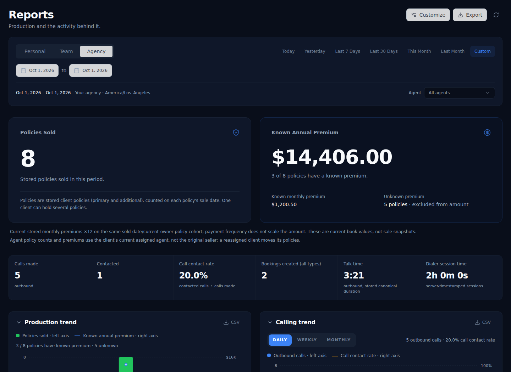
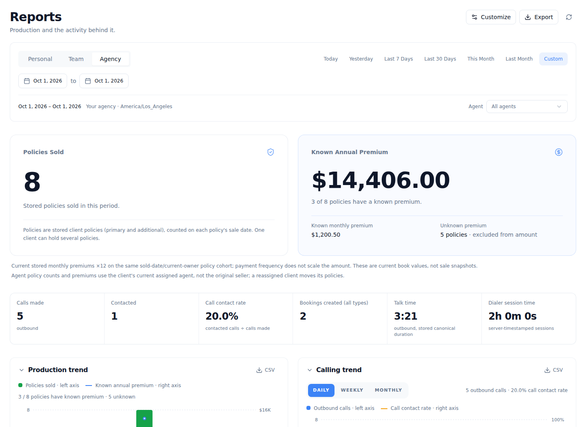
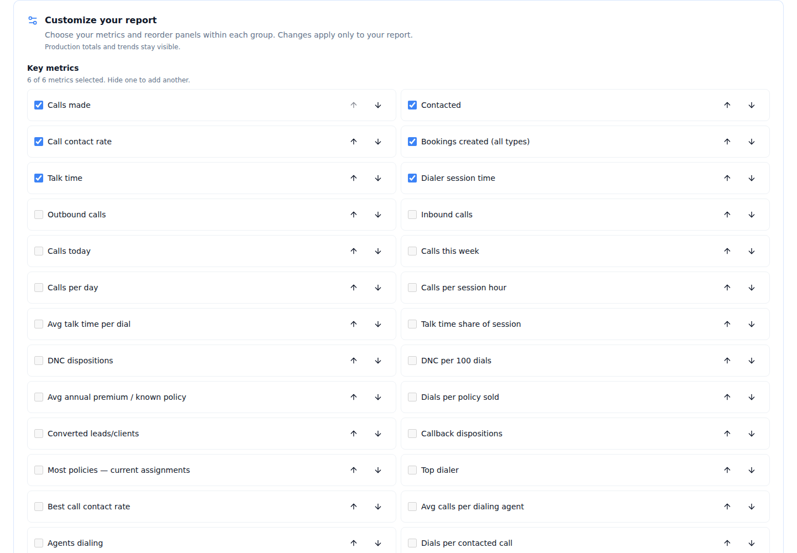
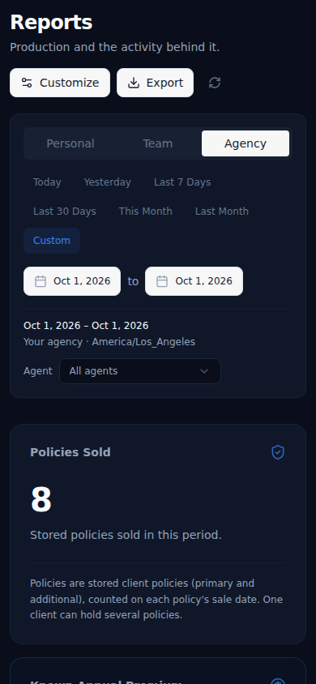

# Reports Phase 2 — verification and context snapshot

## Release status
Implemented on `codex/reports-redesign-phase2-20261006`, based on production/main `92e486ca4bd84ff1ee2938ad38fe94ba39635eba`. Chris authorized starting the previously approved next phase and adding customization. Chris explicitly approved production on October 6 at 08:35 PDT. PR #421 merged as `ff1f21a2d772ff628df16ccd4f52a967c75ecb8a`, with the exact approved tree `6ab39fdefb1a029f32d7de65ba2d88c8ecbd4b9f`. Canonical production deployment `dpl_7RLf9AtEda5b5zMRaLKPed74SQEH` reached READY and served the redesign at `https://www.fflagent.com/reports`. No database change was included. See the initial release snapshot in `production-release.json`.

## Delivered behavior
- Server-authorized Personal / Team / Agency tabs; automatic initial maximum scope remains server-selected. Scope changes clear agent drilldown; identity changes reset to automatic; stale numbers/exports remain withheld.
- Fixed Policies Sold and Known Annual Premium heroes with exact cents, coverage and current-owner/sale-date basis.
- Six-metric strip, production chart with separate policies/premium axes, calling chart with count/percentage axes and weighted grouped rates. Missing premium stays a gap. CSV columns append exact premium/coverage and call contact rate.
- Independent activity/production totals with an explicit non-cohort explanation. Full-width agent performance/efficiency, grouped campaign/source performance and dialer diagnostics.
- Personal show/hide/order customization within bounded groups. Save/Cancel/Reset; explicit failure/pending states. Existing JSONB storage reused, legacy layouts normalized purely, no write-on-read, exact owner checks and stale-completion protection. Reset removes the personal override and reads agency/default layout. No organization-default writes in this personal editor.
- Accessible disclosure, checkbox and move controls; full values wrap on narrow screens; section exports remain separate from collapse actions.

## Evidence already passed
- 197 focused reporting assertions, including 35 normalization/persistence/hook assertions and real-hooks scope integration; zero failures.
- Pinned production Vite build.
- Root TypeScript command. The actual app check reports the same 87 pre-existing diagnostics as baseline, with no additional diagnostic signatures.
- Local real Chromium against genuine embedded SQL fixture responses at 1440px and 390px: no page overflow, visible chart geometry, exact premium cents/coverage/seconds, actual CSV files, mobile/keyboard show-hide-reorder, save/remount, cancel/reset, failed-save recovery, Personal/Team/Agency transitions, agent reset, stale-export withholding, partial failure/retry, stale-window rejection. Light/dark screenshots reviewed. The app shell is intentionally excluded from this isolated fixture.
- Synthetic scope bundles are independently queried from the SQL implementation; no Agency payload is relabeled as Personal/Team. Browser transport uses no hosted credentials/customer records.
- Independent reviews of scope integration, preference identity/persistence, chart calculations and component accessibility.

The broader exact-base frontend regression comparison passed on application commit `6b468da9610362530d9d10ec989879ab849d6b80`: base 4,199 passing assertions, candidate 4,272, the same ten pre-existing failed files/one failed assertion, the same 87 app TypeScript diagnostics, and zero unhandled runtime errors. Focused Reports verification, changed-file ESLint and production build all passed. See `frontend-summary.json`. The final chart requested-scope guard also passed all eight chart assertions.

All four exact-head hosted gates passed: Reports frontend `37459261569`, Reports backend/native SQL + real browser `37459261667`, Reporting integrity `37459261645`, and Dialer/DNC `37459261602`. The PR verification summary links each successful run. Native PostgreSQL CI is distinct from the local embedded SQL run and must not be described as locally executed. `browser-results.txt` records the local browser run; screenshots use synthetic fixture data. Documentation/evidence closeout does not change the verified application source.

## Review images
These screenshots show **synthetic verification data**, not customer/production metrics.

## Preserved limits and decisions
No previous-period comparisons are invented: current contracts do not supply them. No causal funnel conversion rate, campaign premium attribution, lead-source ROI or spend model is added. Phase 1's unresolved historical attribution/duration/booking limitations remain visible in report basis/quality. The previous protected hosted browser session was not accessed; hosted live CSV/filter verification remains unclaimed. Preference saves use ordinary last acknowledged writer behavior; no cross-tab compare-and-swap guarantee exists. A concurrent first-save unique-index conflict is surfaced instead of silently discarding it.

## Rollout
Frontend-only release is complete. Existing Reports migrations and RLS stay unchanged. The approved exact head was merged and the canonical production deployment and public served entry verified. Release closeout is documentation/evidence only, with identical application source; its final deployment is recorded in the closeout PR. Reverting the frontend remains possible: v4 layout JSON keeps the existing sections shape and older migration code can render it; new metrics/panels remain bounded by each version's registry.
