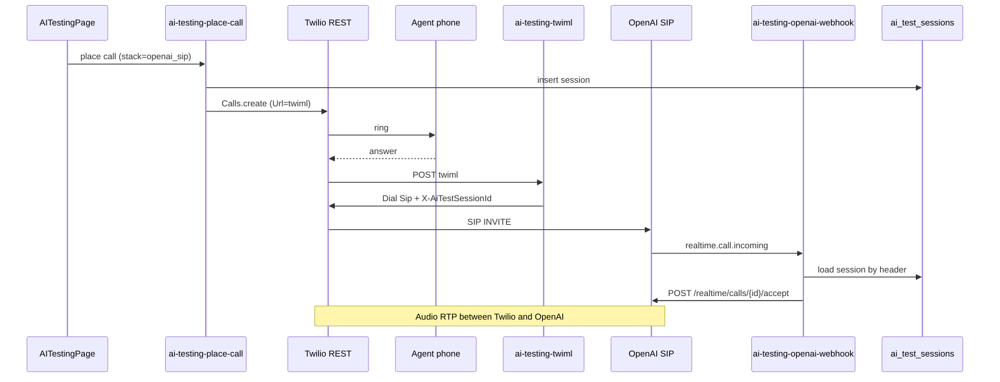

# Implementation Plan | AI Testing — `openai_sip` stack (OpenAI Realtime over SIP)

**Status:** DONE — shipped to `main` (2026-06-02)  
**Date:** 2026-06-02  
**Production project:** `jncvvsvckxhqgqvkppmj`  
**Scope:** AI Testing lab only. No DialerPage, TwilioContext, production dialer Edge Functions, `ai-testing-stream-ws`, or `ai-testing-relay-ws`.

---

## 0. WORK_LOG gate

No `[IN PROGRESS]` entry conflicts with this task. Recent AI Testing work is `[DONE]` (2026-05-19). Permissions phases in archive are unrelated.

---

## 1. Verified architecture (official docs, June 2026)

### OpenAI Realtime SIP ([platform.openai.com/docs/guides/realtime-sip](https://platform.openai.com/docs/guides/realtime-sip))

| Item | Confirmed |
|------|-----------|
| SIP endpoint | `sip:$PROJECT_ID@sip.api.openai.com;transport=tls` (`proj_` prefix from Project → General) |
| Webhook event | `realtime.call.incoming` — register in Project → Webhooks |
| Accept call | `POST https://api.openai.com/v1/realtime/calls/{call_id}/accept` with `Authorization: Bearer`, body `{ type: "realtime", model, instructions, ... }` |
| GA model (docs example) | `gpt-realtime-2` — use env `OPENAI_REALTIME_MODEL` (fallback in code) |
| Webhook auth | Headers `webhook-id`, `webhook-timestamp`, `webhook-signature` (Standard Webhooks); verify with `OPENAI_WEBHOOK_SECRET` via `unwrap` semantics |
| Media path | Twilio ↔ OpenAI SIP directly — **no** AgentFlow media WebSocket |
| Optional monitor WS | `wss://api.openai.com/v1/realtime?call_id=...` — **out of scope** (transcript telemetry deferred) |

### Twilio outbound bridge

| Item | Confirmed |
|------|-----------|
| Pattern | REST `Calls.create` → answer → TwiML `<Dial><Sip>...</Sip></Dial>` ([TwiML Sip](https://www.twilio.com/docs/voice/twiml/sip)) |
| Elastic SIP Trunk | **Not required** for programmatic `<Dial><Sip>`. Trunk origination is for routing **inbound PSTN → OpenAI**; outbound bridge uses **Programmable Voice** ([Twilio warm-transfer SIP tutorial](https://www.twilio.com/en-us/blog/developers/tutorials/product/warm-transfer-openai-realtime-programmable-sip)) |
| Correlation | Custom SIP headers on URI query string, e.g. `sip:proj_xxx@sip.api.openai.com;transport=tls?X-AiTestSessionId={uuid}` — echoed in OpenAI webhook `data.sip_headers` |
| Recording | Keep existing `<Start><Recording .../></Start>` wrapper |

### End-to-end flow (`openai_sip`)

---

## 2. Backend changes

| Function / file | Change |
|-----------------|--------|
| `ai-testing-openai-webhook` (NEW) | `verify_jwt=false`; verify OpenAI signature; on `realtime.call.incoming` correlate `X-AiTestSessionId` → `loadSession` → `accept` with `buildAgentPrompt`, voice, VAD |
| `ai-testing-twiml` | Branch `stack === "openai_sip"` → `<Dial><Sip>…?X-AiTestSessionId=…</Sip></Dial>`; do **not** fall through to stream branch |
| `ai-testing-place-call` | Add `openai_sip` to Zod enum; secrets check for `OPENAI_PROJECT_ID`, `OPENAI_WEBHOOK_SECRET`, `OPENAI_REALTIME_MODEL` |
| `_shared/aiTestingSession.ts` | Extend `AiTestStack` |
| `_shared/openaiWebhookVerify.ts` (NEW) | Standard Webhooks HMAC verify |
| `_shared/openaiRealtimeSip.ts` (NEW) | `turn_detection` + accept payload builder |
| Migration | Relax `ai_test_sessions.stack` CHECK to include `openai_sip` |
| `supabase/config.toml` | `[functions.ai-testing-openai-webhook] verify_jwt = false` |

**Webhook URL (Chris registers in OpenAI console):**  
`https://jncvvsvckxhqgqvkppmj.supabase.co/functions/v1/ai-testing-openai-webhook`

---

## 3. Frontend changes

| File | Change |
|------|--------|
| `AITestingStackSelector.tsx` | New option label |
| `aiTestingFormSchema.ts` | `openai_sip` in enum |
| `aiTestingVoices.ts` | `openai_sip` uses same voice catalog as `openai_realtime` |

---

## 4. Config / blockers (Chris)

Must exist in Edge secrets before live test:

- `OPENAI_API_KEY`
- `OPENAI_PROJECT_ID` (`proj_…`)
- `OPENAI_WEBHOOK_SECRET` (`whsec_…` from OpenAI after registering webhook)
- `OPENAI_REALTIME_MODEL` (recommend `gpt-realtime-2`)

**Chris console steps (not automated):**

1. OpenAI → Project → Webhooks → add URL above, event `realtime.call.incoming`, copy signing secret → Supabase secret `OPENAI_WEBHOOK_SECRET`
2. Confirm `OPENAI_PROJECT_ID` matches the project wired to that webhook

---

## 5. Out of scope (document only)

- Live transcript for SIP stack (needs control WS — separate task)
- Tools, CRM writes, dispositions, human transfer, billing

---

## 6. Files to touch

**New:** `supabase/functions/ai-testing-openai-webhook/index.ts`, `supabase/functions/_shared/openaiWebhookVerify.ts`, `supabase/functions/_shared/openaiRealtimeSip.ts`, `supabase/migrations/20260602120000_ai_test_sessions_openai_sip_stack.sql`

**Modified:** `ai-testing-twiml`, `ai-testing-place-call`, `_shared/aiTestingSession.ts`, `supabase/config.toml`, `src/lib/aiTestingFormSchema.ts`, `src/lib/aiTestingVoices.ts`, `src/components/ai-testing/AITestingStackSelector.tsx`, `scripts/deploy-ai-testing.sh`, `docs/AI_TESTING_SETUP.md`, `WORK_LOG.md`, `implementation_plan.md`

**Explicitly NOT touched:** `DialerPage`, `TwilioContext`, `twilio-*`, `ai-testing-stream-ws`, `ai-testing-relay-ws`

---

## 7. Verification

1. `npx tsc --noEmit` — zero errors  
2. `git diff` — no production dialer / stream-ws / relay-ws  
3. Live: AI Testing → OpenAI Realtime (SIP) → Start → talk → book 15-min appointment  
4. Debug: `twiml.returning` shows `<Dial><Sip>`; edge logs for webhook accept 200
