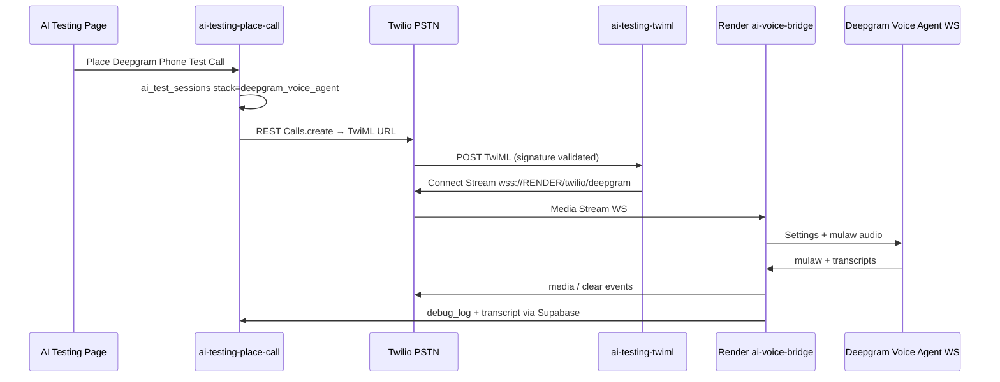

# Implementation Plan | AI Testing — Deepgram Voice Agent (Twilio Media Streams)

**Status:** CODE DONE — pending migration apply + Edge/Render deploy  
**Date:** 2026-06-02  
**Production project:** `jncvvsvckxhqgqvkppmj`  
**Scope:** Add `deepgram_voice_agent` stack for AI Testing only. Compare against existing OpenAI Realtime path on Render (`services/ai-voice-bridge`). **Do NOT** touch DialerPage, TwilioContext, production dialer Edge Functions, CRM dispositions, campaigns, queue logic, or single-leg WebRTC dialer.

---

## 0. WORK_LOG gate

| Check | Result |
|-------|--------|
| `[IN PROGRESS]` on AI Testing / Deepgram | **None** — safe to proceed after approval |
| Recent OpenAI bridge work (2026-06-02) | **Compatible** — extend same Render service + TwiML/place-call patterns |
| Conflict | None |

---

## 1. Architecture (target)



**Key invariant:** `DEEPGRAM_API_KEY` lives only on Render. Browser and Supabase anon client never see it.

---

## 2. Service naming decision

| Spec term | Repo reality | Plan |
|-----------|--------------|------|
| `services/ai-voice-monitor` | **Does not exist** | Extend existing **`services/ai-voice-bridge`** (already in `render.yaml`, prod path `/twilio`) |
| `AI_VOICE_MONITOR_URL` | Today: `AI_VOICE_BRIDGE_WSS_URL` | TwiML accepts **either** env name (monitor preferred in docs) |
| `AI_VOICE_MONITOR_SECRET` | Today: `AI_VOICE_BRIDGE_SECRET` | Bridge accepts **either** secret env name |
| `GET /healthz` | Today: `/health` | Add **`/healthz`** alias (keep `/health`) |
| `WS /twilio/deepgram` | Today: only `/twilio` (OpenAI) | Add **new path**; OpenAI stays on `/twilio` |

Rationale: one always-on Render Web Service, one cold-start surface, shared Supabase logging helpers — matches June 2026 OpenAI bridge rollout.

---

## 3. Deepgram Voice Agent API (confirmed shapes)

Sources: [Twilio + Deepgram Voice Agent](https://developers.deepgram.com/docs/twilio-and-deepgram-voice-agent), [Settings](https://developers.deepgram.com/docs/voice-agent-settings).

| Item | Value |
|------|--------|
| WebSocket | `wss://agent.deepgram.com/v1/agent/converse` (Token auth header: `Authorization: Token {DEEPGRAM_API_KEY}`) |
| First message | JSON `{ "type": "Settings", ... }` immediately after connect |
| Telephony audio | `input`/`output`: `encoding: "mulaw"`, `sample_rate: 8000`, `output.container: "none"` |
| Twilio → bridge | `media.payload` = base64 µ-law JSON |
| Bridge → Deepgram | raw mulaw **bytes** (binary frame or documented binary channel per DG client examples) |
| Deepgram → Twilio | base64 µ-law in `{ event: "media", streamSid, media: { payload } }` |
| STT | `agent.listen.provider`: `type: "deepgram"`, telephony-friendly model (e.g. `nova-3` or `flux-general-en`) |
| LLM | `agent.think.provider`: `type: "open_ai"`, prompt = AgentFlow `buildAgentPrompt` + lead context |
| TTS | `agent.speak.provider`: `type: "deepgram"`, safe default e.g. `aura-2-thalia-en` (map `voice_id` when Deepgram Aura id provided) |
| Greeting | `agent.greeting`: **"Hi, this is Sarah. Can you hear me okay?"** — agent speaks first, no trigger words |
| Ready | `SettingsApplied` → log `deepgram.agent.ready` → if needed, optional `InjectAgentMessage` / keep-alive only if greeting alone insufficient |
| Barge-in | On user speech start event from DG → Twilio `{ event: "clear", streamSid }` |
| Transcripts | DG user/assistant transcript events → `appendTranscript` + debug `user.transcript` / `assistant.transcript` |

---

## 4. Files to create or touch (approval required)

### Database

| Path | Action |
|------|--------|
| `supabase/migrations/20260602140000_ai_test_sessions_deepgram_stack.sql` | **Create** — extend `stack` CHECK to include `deepgram_voice_agent` |

### Supabase Edge (AI Testing only)

| Path | Action |
|------|--------|
| `supabase/functions/_shared/aiTestingSession.ts` | Add `deepgram_voice_agent` to `AiTestStack` |
| `supabase/functions/ai-testing-place-call/index.ts` | Zod + insert for `deepgram_voice_agent`; env check `AI_VOICE_MONITOR_URL` \|\| `AI_VOICE_BRIDGE_WSS_URL` + secret; log `session.created` after insert |
| `supabase/functions/ai-testing-twiml/index.ts` | Branch `deepgram_voice_agent`: Media Stream to `{monitorBase}/twilio/deepgram?sessionId=…`; logs `twiml.returning_deepgram_stream`; **no** OpenAI SIP, **no** `answerOnBridge`, **no** filler `<Say>` |

### Render bridge

| Path | Action |
|------|--------|
| `services/ai-voice-bridge/src/config.ts` | Optional `DEEPGRAM_API_KEY`; secret/url aliases; Zod |
| `services/ai-voice-bridge/src/index.ts` | Routes: `/healthz`, upgrade `/twilio/deepgram` |
| `services/ai-voice-bridge/src/deepgramBridge.ts` | **Create** — Twilio ↔ Deepgram bridge (mirror OpenAI bridge lifecycle/logging) |
| `services/ai-voice-bridge/src/session.ts` | Reuse existing helpers (no duplication) |
| `render.yaml` | Add `DEEPGRAM_API_KEY` env (sync: false) |

### Frontend (AI Testing only)

| Path | Action |
|------|--------|
| `src/lib/aiTestingFormSchema.ts` | Split schemas: `PlaceOpenAICallSchema` / `PlaceDeepgramCallSchema` (stack fixed per button) |
| `src/lib/aiTestingVoices.ts` | Add `deepgram_voice_agent` catalog (Aura voices) |
| `src/hooks/useAITestingSession.ts` | `placeOpenAICall` / `placeDeepgramCall` with distinct `placingStack` for UI |
| `src/components/ai-testing/AITestingCallButtons.tsx` | Two buttons: OpenAI + Deepgram |
| `src/pages/AITestingPage.tsx` | Remove `AITestingStackSelector`; wire dual place handlers; hide voice/tunables for Deepgram or scope tunables to OpenAI only |
| `src/components/ai-testing/AITestingStackSelector.tsx` | **Remove usage** (file can remain unused or delete in same PR) |

### Docs / ops

| Path | Action |
|------|--------|
| `docs/AI_TESTING_SETUP.md` | Deepgram section (env, test steps, compare OpenAI, lab-only disclaimer) |
| `implementation_plan.md` | This file |
| `WORK_LOG.md` | Append after implementation + verification |

### Explicitly NOT touched

`DialerPage.tsx`, `TwilioContext.tsx`, `twilio-*`, `dialer-*`, `ai-testing-stream-ws` (reference only), production campaign/queue code.

---

## 5. PART 1 — UI behavior

- **Keep:** mock lead form, prompt editor, phone inputs, debug panel, live status panel.
- **Remove from page:** multi-stack selector (`AITestingStackSelector`).
- **Add two actions:**
  - **Place OpenAI Phone Test Call** → `stack: "openai_realtime"` (existing semi-working path).
  - **Place Deepgram Phone Test Call** → `stack: "deepgram_voice_agent"`.
- **State/logging:** separate `placingOpenAI` / `placingDeepgram` (or `placingStack`) so debug panel and toasts show which path is active.
- **Voice/tunables:** show for OpenAI button path only; Deepgram uses server default TTS + fixed opening line.

---

## 6. PART 2 — `ai-testing-place-call`

- Validate super-admin JWT (unchanged).
- On Deepgram place:
  - Require monitor WSS base: `DEEPGRAM_VOICE_AGENT_URL` **ignored for Twilio URL** — use `AI_VOICE_MONITOR_URL` or fallback `AI_VOICE_BRIDGE_WSS_URL` (base must end at service host; path added in TwiML).
  - Require `AI_VOICE_MONITOR_SECRET` or `AI_VOICE_BRIDGE_SECRET`.
  - Twilio creds: existing `loadOutboundTwilioCreds()` (`TWILIO_ACCOUNT_SID` / `TWILIO_MASTER_ACCOUNT_SID` + token).
- Insert `ai_test_sessions` with `stack = 'deepgram_voice_agent'`, prompt, lead_context, phones, transcript `[]`, debug_log `[]`.
- Log **`session.created`** (new) then existing **`place_call.start`** / **`place_call.placed`**.
- Twilio `Url` → `ai-testing-twiml?sessionId=…` (unchanged pattern).

---

## 7. PART 3 — `ai-testing-twiml` (Deepgram branch)

```xml
<Response>
  <Connect>
    <Stream url="wss://{RENDER_HOST}/twilio/deepgram?sessionId={sessionId}&secret={SECRET}">
      <Parameter name="sessionId" value="{sessionId}" />
      <Parameter name="bridgeSecret" value="{SECRET}" />
    </Stream>
  </Connect>
</Response>
```

- Optional `track="inbound_track"` (parity with OpenAI fix) — evaluate during implementation; default include if OpenAI path uses it.
- Validate Twilio signature → log `twiml.signature_check`.
- Log `twiml.received`, `twiml.returning_deepgram_stream` (not generic `twiml.returning` only for this stack).
- No recording change required (keep existing `<Start><Recording>` wrapper unless it interferes — same as OpenAI).

---

## 8. PART 4 — Render `deepgramBridge.ts`

**Upgrade handler** `/twilio/deepgram`:

1. Resolve `sessionId` + secret from query + `start.customParameters` (same pattern as OpenAI bridge fix).
2. Timing-safe secret compare.
3. `loadSession` → must be `stack === 'deepgram_voice_agent'`.
4. Log `twilio.stream.connected` on Twilio WS open.
5. Open Deepgram WS → `deepgram.ws.connecting` → `deepgram.ws.connected`.
6. Send **Settings** immediately (mulaw 8k, agent prompt, listen/think/speak providers).
7. Log `deepgram.settings.sent` → on `SettingsApplied` → `deepgram.agent.ready`.
8. Greeting via Settings `agent.greeting` + log `deepgram.greeting_sent`.
9. On Twilio `start` → `twilio.stream.started`.
10. On Twilio `media` → decode base64 → forward raw mulaw to Deepgram.
11. On Deepgram audio → base64 → Twilio `media`.
12. Transcripts → Supabase + `user.transcript` / `assistant.transcript` debug events.
13. Barge-in → Twilio `clear`.
14. Errors → `appendDebugLog` with exact event type/message.
15. Close → `twilio.stream.closed`, `deepgram.ws.closed`, session `completed`/`failed`.

Reuse `appendDebugLog`, `appendTranscript`, `updateSession` from `session.ts`.

---

## 9. PART 5 — Opening behavior

- Fixed greeting: **"Hi, this is Sarah. Can you hear me okay?"**
- No trigger words / no `<Say>` filler on TwiML.
- Agent speaks first when Deepgram session is ready (Settings `agent.greeting`).
- If Deepgram requires an extra client message post-`SettingsApplied`, send documented `InjectAgentMessage` only as fallback (implement if greeting does not play in first test).

---

## 10. PART 6 — Required debug_log sequence (Deepgram)

| Order | Event |
|-------|--------|
| 1 | `session.created` |
| 2 | `place_call.start` |
| 3 | `place_call.placed` |
| 4 | `twiml.received` |
| 5 | `twiml.signature_check` |
| 6 | `twiml.returning_deepgram_stream` |
| 7 | `twilio.stream.connected` |
| 8 | `deepgram.ws.connecting` |
| 9 | `deepgram.ws.connected` |
| 10 | `deepgram.settings.sent` |
| 11 | `deepgram.agent.ready` |
| 12 | `deepgram.greeting_sent` |
| 13+ | `user.transcript` / `assistant.transcript` (as speech occurs) |
| end | `twilio.stream.closed`, `deepgram.ws.closed`, `call.completed` |
| fail | exact failure event + `error_message` on session row |

---

## 11. Environment variables

### Supabase Edge secrets

| Variable | Purpose |
|----------|---------|
| `TWILIO_ACCOUNT_SID` or `TWILIO_MASTER_ACCOUNT_SID` | Outbound call |
| `TWILIO_AUTH_TOKEN` or `TWILIO_MASTER_AUTH_TOKEN` | Twilio REST + signature |
| `AI_VOICE_MONITOR_URL` or `AI_VOICE_BRIDGE_WSS_URL` | Base WSS, e.g. `wss://ai-voice-bridge.onrender.com` (no path) |
| `AI_VOICE_MONITOR_SECRET` or `AI_VOICE_BRIDGE_SECRET` | Query + Twilio Parameter |
| `OPENAI_API_KEY` | Still required for OpenAI test button path |

**Not on Supabase:** `DEEPGRAM_API_KEY`.

### Render (`ai-voice-bridge`)

| Variable | Purpose |
|----------|---------|
| `DEEPGRAM_API_KEY` | Deepgram Voice Agent WS auth |
| `SUPABASE_URL` | Session + logs |
| `SUPABASE_SERVICE_ROLE_KEY` | Service writes |
| `AI_VOICE_MONITOR_SECRET` or `AI_VOICE_BRIDGE_SECRET` | Bridge auth |
| `PORT` | Set by Render |
| `OPENAI_*` | Unchanged for `/twilio` OpenAI route |

---

## 12. Verification checklist (post-implementation)

- [ ] `npx tsc --noEmit` (repo root)
- [ ] `cd services/ai-voice-bridge && npm install && npm run build`
- [ ] Migration applied (`deepgram_voice_agent` in CHECK)
- [ ] Deploy: `ai-testing-place-call`, `ai-testing-twiml` only (+ Render redeploy)
- [ ] AI Testing page loads; OpenAI button still works
- [ ] Deepgram button places call; lead hears Sarah greeting first; two-way audio
- [ ] Debug panel shows full sequence §10
- [ ] No production dialer files in diff
- [ ] No Deepgram key in browser network tab

---

## 13. Deploy order (after approval)

1. Apply migration locally/prod.
2. Implement + typecheck.
3. Set Supabase secrets (`AI_VOICE_MONITOR_URL` if renaming).
4. Deploy Edge functions (`place-call`, `twiml`).
5. Redeploy Render `ai-voice-bridge` with `DEEPGRAM_API_KEY`.
6. Super Admin → AI Testing → compare OpenAI vs Deepgram calls.

---

## 14. Open questions for Chris (optional before build)

1. **Deepgram LLM inside Voice Agent:** use OpenAI via Deepgram `think.provider` (requires OpenAI key on Render too) vs Deepgram-managed model only?
2. **Retain `twilio_cr` stack** in DB/UI hidden, or leave DB enum but UI only shows two buttons?
3. **Render URL secret name:** standardize on `AI_VOICE_MONITOR_*` in dashboard going forward?

---

**Next step:** Reply **approve** (or note amendments). Then implementation proceeds in one surgical PR batch per parts 1–7.
