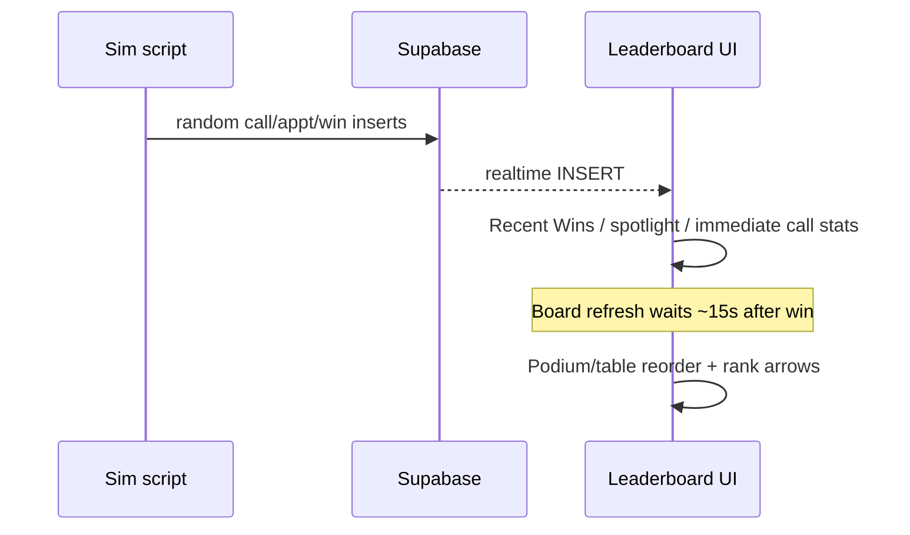

# Leaderboard simulation — random realistic activity

**Scope:** Dev/ops script only (`scripts/simulate-leaderboard-activity.mjs`) + optional DEV console logs in `useLeaderboardData.ts` + minor countdown label fix.  
**Status:** [DONE] — implemented 2026-05-21.

---

## Work log / conflict check

| Entry | Relevance |
|-------|-----------|
| Win → spotlight → paced board refresh [DONE] | **Do not change** board timing logic; sim must decouple from 15s |
| Fire preview removed | N/A |
| Rank arrows = live refresh movement | Preserve; board logs only in DEV |

No `[IN PROGRESS]` conflicts.

---

## Production data warning

The sim **already writes live rows** to Chris home org (`a0000000-…0001`) when run with `ALLOW_PRODUCTION=yes`. This plan **does not change that gate** or add UI controls — only **what** gets inserted and **when**. Same safety model as today.

---

## Current problem

`scripts/simulate-leaderboard-activity.mjs`:

- Uses `setInterval(..., DEMO_INTERVAL_MS)` default **15s**
- Every tick inserts **call + win + appointment** for the same catch-up agent
- CLI countdown says “Next win in 15s” — falsely synced with UI scoreboard countdown

Result: simulated events feel locked to the 15s scoreboard refresh, making the staged UX hard to evaluate.

**Leaderboard app (unchanged in behavior):**

- Wins → Recent Wins + spotlight immediately; board refresh **~15s later** (`BOARD_REFRESH_MS`)
- Calls/appts → board can refresh immediately (unless win pending timer active)
- Bottom-right widget counts down scoreboard refresh (resets on win) — label still says “Next win” (misleading)

---

## Solution overview

**Simulation creates events on its own random clock.**  
**Leaderboard decides when the scoreboard moves.**  
No coupling between sim scheduler and `VITE_LEADERBOARD_DEMO_INTERVAL_MS`.



---

## 1. Refactor `simulate-leaderboard-activity.mjs`

### Remove

- `setInterval` fixed 15s loop
- `DEMO_INTERVAL_MS` as activity driver (keep env read only if we document deprecated, or remove)
- Sim-side “Next win in Xs” countdown (misleading)
- “Each tick = call + win + appt bundle”

### Add — recursive random scheduler

```text
scheduleNext():
  delay = random (see below)
  setTimeout → runOneEvent() → scheduleNext()
```

**Delay distribution:**

| Mode | Probability | Range |
|------|-------------|-------|
| Normal | ~85% | 1.5s – 8s |
| Quiet | ~15% | 8s – 18s |

**Event type (weighted roll):**

| Type | Weight | Action |
|------|--------|--------|
| call | 65% | Insert one outbound call |
| appointment | 15% | Insert one appointment |
| win | 15% | Insert one win (+ premium_amount) |
| burst | 5% | 2–5 events, 250–1800ms apart (call/appt/win only, no nested burst) |

### Agent selection (varied, not always catch-up)

Before each event, refresh lightweight “today” counts (wins + calls per agent — one query each or combined).

| Strategy | Weight | Behavior |
|----------|--------|----------|
| Random | 40% | Any agent in pool |
| Catch-up | 25% | Fewest wins today (existing logic, tie-break rotate) |
| Mid-pack | 20% | Agent in middle third by today’s wins (boundary movement) |
| Lower activity | 15% | Agent in bottom half by today’s calls |

Pool = existing `resolveRaceAgents()` / demo org agents. No new users.

**Call realism:** random duration 45–240s, varied dispositions mostly non-sale, occasional “Sold”.  
**Win realism:** random policy type, premium $85–$280/mo, unique contact names.  
**Appt realism:** scheduled 1–48h out, unique title/contact.

### Logging (sim console only)

Elapsed time since sim start:

```text
[sim 4.2s] call: Nick Testing +1 call, 92s talk
[sim 6.7s] win: Casey Brooks closed Final Expense ($143/mo)
[sim 8.0s] appointment: Evan Pierce scheduled
[sim 13.1s] burst: 3 events (call, call, appointment)
[sim 17.5s] quiet — next event in 12.4s
```

Startup banner explains: **events are random; scoreboard refresh is separate (~15s after wins in UI).**

### Cleanup

- `SIGINT` clears pending `setTimeout`
- Single `stopping` flag prevents reschedule after interrupt

---

## 2. Optional DEV board logs — `useLeaderboardData.ts`

Only when `import.meta.env.DEV`:

| When | Log |
|------|-----|
| Win schedules paced refresh | `[board] pending win update, scoreboard refresh in ~15s` |
| Timer fires `fetchData` | `[board] applying paced scoreboard refresh` |
| `applyRankAnimations` has movement | `[board] rank movement: Casey Brooks #5 → #2` (top movers only, cap 3 lines) |

No logs in production builds. No behavior change.

---

## 3. Minor label fix — `LeaderboardDemoCountdown.tsx`

Change copy from **“Next win in Xs”** → **“Scoreboard refresh in Xs”** so the widget matches actual behavior (resets on win, tracks board not sim).

One-line UI change; helps evaluation. Omit if Chris prefers zero UI touch.

---

## Files to touch (after approval)

| File | Change |
|------|--------|
| `scripts/simulate-leaderboard-activity.mjs` | Random scheduler, weighted events, agent variety, logging |
| `src/hooks/useLeaderboardData.ts` | DEV-only `[board]` console logs (optional) |
| `src/components/leaderboard/LeaderboardDemoCountdown.tsx` | Label text (optional, recommended) |
| `implementation_plan.md` | This plan |
| `WORK_LOG.md` | After implementation + `npx tsc --noEmit` |

**Not touching:** Supabase schema, migrations, RLS, leaderboard components (podium/table/recent wins logic), package.json scripts (same `npm run leaderboard-demo:simulate` entry).

---

## Verification plan

1. `ALLOW_PRODUCTION=yes npm run leaderboard-demo:simulate` — confirm logs show irregular `[sim Xs]` intervals (not every 15s)
2. Open `/leaderboard` — wins appear in Recent Wins at random times; spotlight follows; board moves on ~15s countdown after wins
3. Multiple wins within one countdown window → one board reorder, no jitter
4. Calls/appts update call/appt metrics without waiting for win cadence
5. `npx tsc --noEmit`

---

## Decisions for Chris

1. **DEV board logs in hook** — add? **Recommended yes** (dev-only, helps verify staging).
2. **Countdown label** — rename to “Scoreboard refresh”? **Recommended yes**.
3. **Catch-up agent logic** — keep as one strategy (25%), not dominant? **Recommended yes**.

---

## Context snapshot (post-implementation)

**Changes:** Rewrote `simulate-leaderboard-activity.mjs` — recursive random `setTimeout` scheduler (1.5–8s normal, 8–18s quiet), weighted events (65/15/15/5), varied agent selection, burst clusters, warmup guarantees call+appt+win early. DEV `[board]` logs in `useLeaderboardData.ts`. Countdown label → “Scoreboard refresh”.

**Decisions:** Sim timing fully decoupled from 15s board refresh; same `ALLOW_PRODUCTION=yes` gate; no UI sim controls.

**Migrations/deploys:** None.

**Blockers:** None.

**Next steps:** Run `ALLOW_PRODUCTION=yes npm run leaderboard-demo:simulate` and verify irregular `[sim Xs]` logs vs `[board]` paced refresh in browser console.

---

2026-05-21 | [DONE] Leaderboard sim — random realistic activity timing. What: Replaced fixed 15s tick (call+win+appt bundle) with random event scheduler — weighted call/appt/win/burst, varied agent selection, 30s warmup covering all six metrics, decoupled from scoreboard refresh cadence. DEV `[board]` logs in hook; countdown label now “Scoreboard refresh”.

Notes: Files — `scripts/simulate-leaderboard-activity.mjs`, `useLeaderboardData.ts`, `LeaderboardDemoCountdown.tsx`, `implementation_plan.md`. `npx tsc --noEmit` clean. No schema/backend changes.

---

# Leaderboard win feed → agent spotlight → rank update sequence

**Scope:** Frontend-only display sequencing. No backend, schema, RPC, migration, or RLS changes.  
**Status:** [DONE] — implemented 2026-05-21.

---

## Work log / conflict check

Recent related entries (no blocking conflicts):

| Date | Entry | Relevance |
|------|-------|-----------|
| 2026-05-21 | Fire preview removed | No fire/on-fire code in tree; do not reintroduce unless Chris asks |
| 2026-05-21 | Rank arrows = live refresh movement | Must preserve; arrows only when `applyRankAnimations` runs on a new board snapshot |
| 2026-05-21 | Recent Wins scroll cap | Panel layout unchanged except optional entrance animation |

---

## Current behavior (problem)

In `useLeaderboardData.ts`, a realtime `wins` INSERT handler does:

1. `flashWin(row.id, row.agent_id)` — sets win + agent highlight **together**
2. `refresh()` — calls **`fetchData` + `fetchWins` in the same tick**

Result: Recent Wins, agent highlight, podium/table ranks, rank arrows, and stat pulses all update at once. The story “win → agent lights up → board moves” is lost.

Additional notes:

- `Win` already includes `agent_id`; `fetchWins` uses `select("*")` — reliable id without backend changes.
- `LeaderboardDemoCountdown` uses `VITE_LEADERBOARD_DEMO_INTERVAL_MS` (default **15s**) but is **visual only** — it does not gate rank refresh.
- Background poll uses `VITE_LEADERBOARD_POLL_MS` (default **4s**) and also calls full `refresh()`.
- `flashWin` clears win + agent highlight after **1.5s** (too short; simultaneous).
- `agentHighlightClass` already supports `flashingAgentId` → `animate-agent-win-highlight` (one-shot outline).

---

## Target UX sequence

| Phase | Timing | What updates |
|-------|--------|--------------|
| 1 — Event feed | **0ms** | New win appears at top of Recent Wins (slide/fade + brief glow, ~2–3s) |
| 2 — Agent spotlight | **500ms** (300–700ms range) | Winning agent card/row gets warm ring/pulse (distinct from rank arrows) |
| 3 — Scoreboard | **Next paced board cycle** (default **15s**, aligned with demo countdown env) | Podium + table ranks/stats reorder; rank arrows computed only here |

Principle: **Recent Wins = event feed. Podium/table = scoreboard result.**

Spotlight stays visible through phase 3 so users can track the agent as rows animate (~3–4s total spotlight, refreshed on newer win).

---

## Proposed architecture

### A. Sequencing layer in `useLeaderboardData.ts`

Add a small win-event coordinator (refs + timers, cleaned up on unmount / filter change):

```ts
// Timing constants (tunable)
const WIN_FLASH_MS = 2500;
const SPOTLIGHT_DELAY_MS = 500;
const SPOTLIGHT_DURATION_MS = 3500;
const BOARD_REFRESH_MS = Number(import.meta.env.VITE_LEADERBOARD_DEMO_INTERVAL_MS || 15000);
```

**New state exposed from hook:**

| State | Purpose |
|-------|---------|
| `flashingWinId` | Recent Wins row highlight (existing, longer duration) |
| `spotlightAgentId` | Winning agent ring/pulse on podium + table + TV (new) |

**Refs:**

- `pendingBoardRefreshRef` — boolean; board fetch scheduled for next cycle
- `boardRefreshTimerRef` — timeout to next 15s boundary (or debounced single fire)
- `spotlightTimerRef`, `winFlashTimerRef` — cleanup on unmount
- `movementFilterKey` change → clear all timers + spotlight/win flash state

### B. Win INSERT handler (replace immediate full refresh)

On `wins` INSERT:

1. **Immediate:** `fetchWins({ silent: true })` only (or merge payload row optimistically if fetch is slow — prefer fetch for consistency).
2. **0ms:** `setFlashingWinId(winId)`; reset demo countdown via existing `resetKey` in `Leaderboard.tsx`.
3. **500ms:** `setSpotlightAgentId(agent_id)` if present (from realtime payload — most reliable).
4. **Schedule board refresh:** mark pending; if no timer running, start timer to fire at next `BOARD_REFRESH_MS` boundary (or single debounced refresh per burst window).
5. **Do not** call `fetchData` synchronously on win INSERT.

On timer fire:

- `fetchData({ silent: true })` → `applyRankAnimations` runs → rank arrows/motions update **only here**.
- Clear `pendingBoardRefreshRef`; schedule next interval if wins still pending (or use repeating interval aligned to 15s).

### C. Calls / appointments INSERT

Keep immediate `fetchData` for non-win telemetry **or** route through same paced cycle (recommend: **wins defer board; calls/appts keep immediate silent refresh** so dial stats stay live without jitter from wins). Document in code comment.

### D. Poll fallback (`VITE_LEADERBOARD_POLL_MS`)

Change poll to:

- Always refresh wins silently.
- Refresh board only when `pendingBoardRefreshRef` is false **or** paced timer fires — avoid double-fetch on win bursts.

### E. Burst wins

- Each win: append to Recent Wins order (via refetch).
- Spotlight: **newest win’s agent** replaces previous (reset spotlight timer).
- Board: **one** rank refresh per 15s window (coalesce).

### F. Rank arrow semantics (unchanged logic)

- `computeRankMovements` / `applyRankAnimations` only run inside deferred `fetchData`.
- No rank movement UI when only win feed + spotlight update.

---

## Visual design

### Recent Wins (`RecentWinsPanel.tsx`)

- Keep `animate-leaderboard-flash`; extend duration via hook timing (~2.5s).
- Optional: `AnimatePresence` + subtle `initial={{ opacity: 0, y: -6 }}` on newest row only (keyed by `wins[0]?.id`).

### Agent spotlight (new, reusable)

Extend `leaderboardHighlight.ts`:

```ts
spotlightAgentId?: string | null;
// → animate-leaderboard-spotlight (new keyframe: warm ring + soft box-shadow pulse, 2.4s ease-in-out)
```

Distinct from:

- `animate-agent-win-highlight` (one-shot yellow outline — can retire for wins in favor of spotlight, or keep as secondary)
- Rank up/down glow (movement only)
- `statPulseIds` (metric bump on board refresh)

Apply via existing `agentHighlightClass()` — no duplicate logic in podium/table/TV.

Optional small “New win” badge on spotlighted row/card — **only if it fits without clutter**; flame/fire preview **not** in scope (removed).

### TV Mode

Pass `spotlightAgentId` through same props as `flashingAgentId`. TV ticker/wins panel already uses hook data; sequence identical.

---

## Files to touch (after approval)

| File | Change |
|------|--------|
| `implementation_plan.md` | This plan (done) |
| `src/hooks/useLeaderboardData.ts` | Win sequencing, paced board refresh, new `spotlightAgentId`, timer cleanup |
| `src/components/leaderboard/leaderboardHighlight.ts` | Add spotlight class branch |
| `tailwind.config.ts` | `leaderboard-spotlight` keyframe + animation (lightweight box-shadow/opacity) |
| `src/components/leaderboard/RecentWinsPanel.tsx` | Longer flash; optional entrance animation |
| `src/pages/Leaderboard.tsx` | Pass `spotlightAgentId` to podium/table/TV |
| `src/components/leaderboard/LeaderboardPodium.tsx` | Pass spotlight to cards |
| `src/components/leaderboard/LeaderboardPodiumCard.tsx` | Wire `agentHighlightClass` spotlight |
| `src/components/leaderboard/LeaderboardRankingsTable.tsx` | Wire spotlight |
| `src/components/leaderboard/TVMode.tsx` | Wire spotlight |
| `WORK_LOG.md` | Append after implementation + `npx tsc --noEmit` |

**Not touching:** Supabase, migrations, win creation, scoring RPCs, CSV export, filters, rank motion math, fire preview (deleted).

---

## Verification plan

1. `npx tsc --noEmit`
2. Manual with demo sim (`simulate-leaderboard-activity.mjs`, 15s interval):
   - Win appears in Recent Wins first
   - ~0.5s later agent row/card gets warm spotlight
   - Podium/table ranks do **not** jump until next ~15s board cycle (countdown aligns)
   - Rank arrows appear only on board cycle, not on win feed update
3. Burst: 2 wins within 5s → two feed entries, spotlight moves to latest, **one** board reorder
4. Change period/view/metric → spotlight cleared, no stale timers
5. TV Mode: same sequence visible

---

## Decisions for Chris (confirm before build)

1. **Board refresh interval:** Use existing `VITE_LEADERBOARD_DEMO_INTERVAL_MS` (15s default) to align countdown UI with actual scoreboard refresh — **recommended yes**.
2. **Calls/appts realtime:** Keep immediate board refresh for non-win events — **recommended yes** (dial stats stay live).
3. **State naming:** Export `spotlightAgentId` (keep `flashingWinId` for feed) — **recommended yes**.
4. **Retire simultaneous `flashingAgentId` on win:** Replace win-path agent highlight with delayed `spotlightAgentId` only — **recommended yes**.

---

## Context snapshot (post-implementation)

**Changes:** Win INSERT handler now runs `beginWinSequence` + `fetchWins` only; `schedulePacedBoardRefresh` defers `fetchData` by `VITE_LEADERBOARD_DEMO_INTERVAL_MS` (15s). Poll skips board refresh while a paced timer is active. `spotlightAgentId` replaces `flashingAgentId` with delayed warm ring via `animate-leaderboard-spotlight`.

**Decisions:** Board refresh interval = demo countdown env; calls/appts keep immediate board refresh; newest win wins spotlight on bursts; spotlight duration spans through board refresh (~16s from win).

**Migrations/deploys:** None.

**Blockers:** None.

**Next steps:** Manual verify with demo sim — confirm win feed → ~0.5s spotlight → ~15s rank motion; rank arrows only on board cycle.
